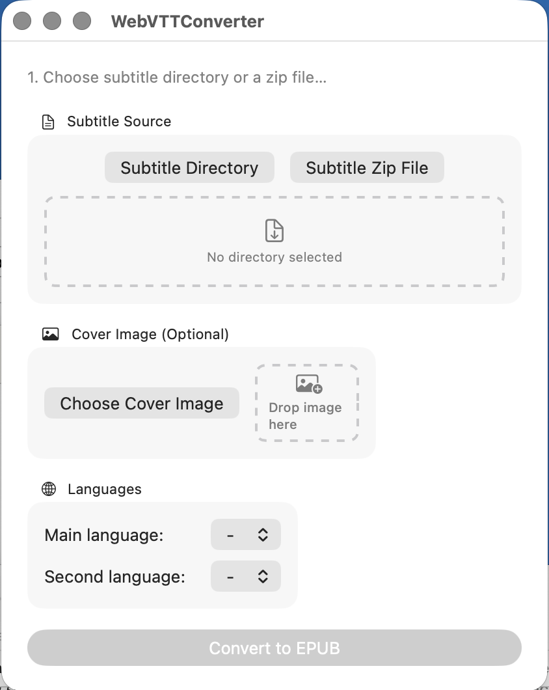

# WebVTT Converter

A native macOS SwiftUI app that converts Netflix WebVTT subtitle files into EPUB ebooks — no Calibre dependency required.

Ported from the [Calibre WebVTT Converter plugin](https://github.com/nicekao/webvtt_converter_plugin), rewritten in Swift with standalone EPUB generation using [ZIPFoundation](https://github.com/weichsel/ZIPFoundation).

## Screenshot



## Features

- **WebVTT to EPUB** — Parse `.vtt` subtitle files and generate valid EPUB 3 ebooks
- **Dual language support** — Main language displayed normally, secondary language in smaller gray text
- **ZIP file support** — Load subtitles from a ZIP archive or a directory
- **Cover image** — Optionally add a cover image to the generated EPUB
- **Drag and drop** — Drag subtitle ZIP/folder and cover images directly onto the app
- **Season/Episode detection** — Automatically organizes multi-season series with proper Table of Contents
- **Closed caption styling** — `[CC]` captions rendered at reduced size

## How to Get Subtitles

1. Install [Tampermonkey](https://chrome.google.com/webstore/detail/tampermonkey/dhdgffkkebhmkfjojejmpbldmpobfkfo) in Chrome
2. Install the [Netflix subtitle downloader](https://greasyfork.org/en/scripts/26654-netflix-subtitle-downloader) userscript
3. Play a show on Netflix and download the subtitles as a ZIP

## Usage

1. Select a subtitle directory or ZIP file (button or drag-and-drop)
2. Optionally choose a cover image
3. Select main language and (optionally) a second language
4. Click **Convert to EPUB**
5. Choose where to save the EPUB file

## Requirements

- macOS 13.0+
- Swift 5.9+

## Build & Run

```bash
cd WebVTTConverter
swift build
swift run
```

Or open `Package.swift` in Xcode.

## License

GPL v3
